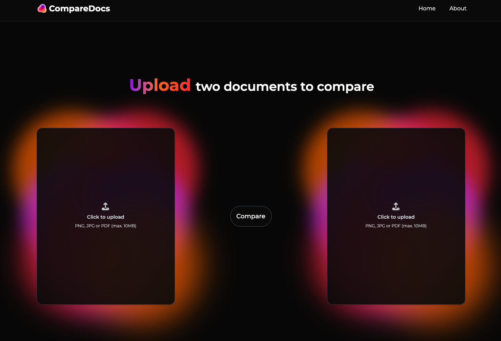
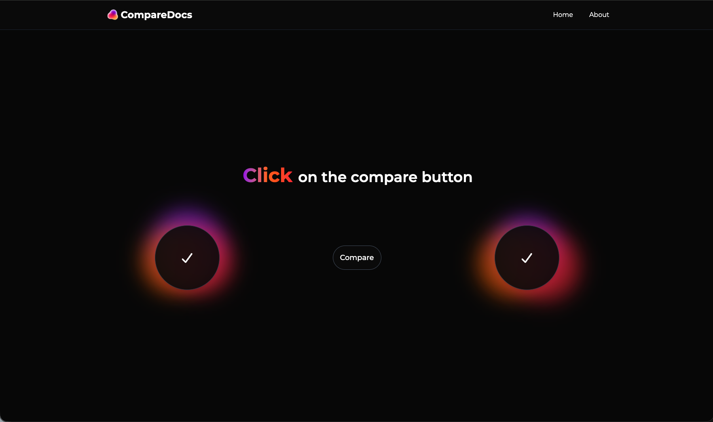
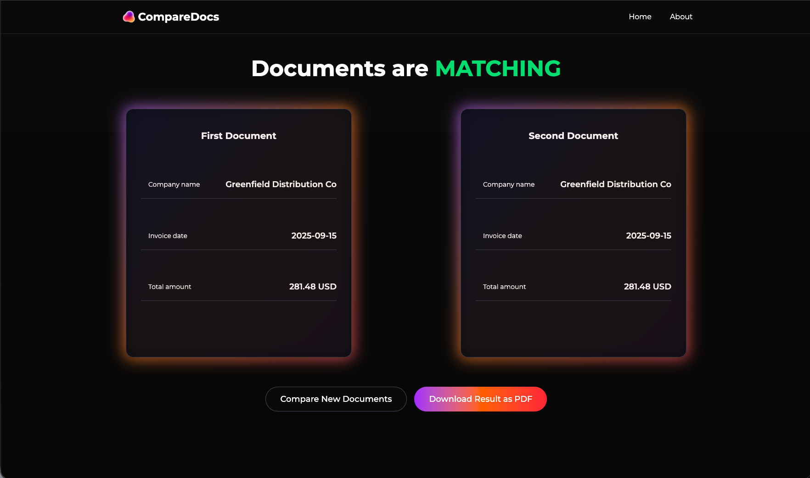
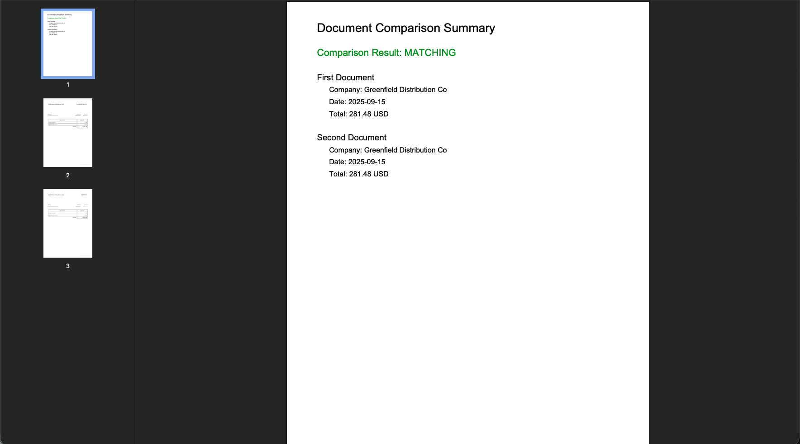

# CompareDocs




CompareDocs is a full‑stack document matching tool that compares two business documents (invoice vs. delivery note) using OCR + LLM extraction. It focuses on practical matching signals like date, company name, and amount, and returns a structured comparison result.

[](https://github.com)
[](https://nodejs.org/)
[](https://expressjs.com/)
[](https://react.dev/)
[](https://vitejs.dev/)
[](https://tailwindcss.com/)
[](https://github.com/tesseract-ocr/tesseract)
[](https://openai.com/)

## Highlights
- Upload two documents (invoice + delivery note) and compare them instantly
- OCR pipeline converts PDFs/images into text
- LLM extracts structured fields and checks document consistency
- Clean UI built with React, Vite, and Tailwind

## How It Works
1. **Upload** two documents in the frontend.
2. **OCR layer** extracts raw text from files.
3. **LLM layer** extracts structured invoice fields.
4. **Comparator** evaluates field-level consistency and returns a result.

## Repo Layout
- `backend/`: Express backend for upload, OCR, and LLM compare
  - `server.js`: API entrypoint
  - `routes/`: invoice compare routes
  - `controllers/`: orchestration layer
  - `services/`: OCR, PDF utilities, OpenAI integration
  - `documents/`: uploaded files
  - `temp/`: intermediate artifacts
- `frontend/`: React + Vite UI with Tailwind styling
  - `src/components/`: Upload form, loader, UI elements
  - `src/fetch/`: API client helpers

## Prerequisites
- Node.js 18+
- OpenAI API key (backend `.env`)

## Run Locally
### Backend
```bash
cd backend
npm install
npm run dev
```

Create `.env` in `backend/`:
```
OPENAI_API_KEY=your_openai_key_here
```

### Frontend
```bash
cd frontend
npm install
npm run dev
```

Open the Vite URL (usually `http://localhost:5173`).

## API
`POST /api/invoices/compare`
- multipart form‑data: `invoice1`, `invoice2`, `lang`
- returns JSON with extracted fields and a match decision

## Notes
- OCR quality can affect extraction accuracy; PDF scans may need higher resolution.
- Prompts live in `backend/prompts/` and can be tuned for better field extraction.

## Screenshots



